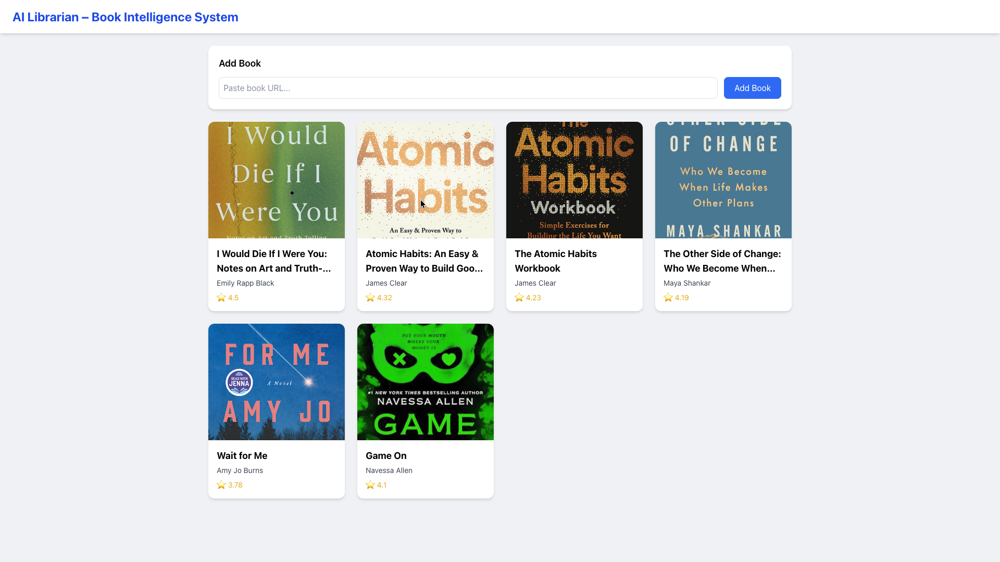
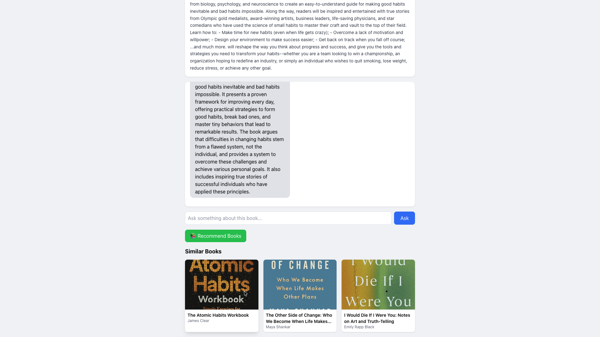

# 🤖 AI Librarian – Book Intelligence System

An AI-powered full-stack web application that allows users to upload book links, explore insights, and ask intelligent questions using a Retrieval-Augmented Generation (RAG) pipeline.

---

## 🚀 Features

### 📚 Book Upload & Management

* Add books using URL (www.goodreads.com)
* Automatically scrape book details (title, author, description, image)
* Store and display books in a responsive dashboard

### 🧠 AI Question Answering (RAG)

* Ask questions about a specific book
* Retrieves relevant content using embeddings
* Generates answers using Gemini LLM

### 📖 Book Recommendations

* Suggest similar books using semantic similarity
* Based on vector embeddings (ChromaDB)

### 💬 Interactive UI

* Chat-style interface for asking questions
* Modern responsive UI with Tailwind CSS
---
## 📸 Screenshots

### 🏠 Dashboard – Book Collection
 

Displays all added books with title, author, rating, and cover image in a responsive grid layout.

* Clean card-based UI
* Responsive design for all screen sizes
* Click any book to explore details

---

### ➕ Add Book with Scraping


Users can paste a book URL and the system automatically scrapes details.

* Real-time loading indicator
* “Scraping your book…” feedback
* Prevents duplicate submissions

---

### 📖 Book Detail + AI Chat


Detailed view of a selected book with description and AI-powered chat interface.

* Ask questions about the book
* Chat-style UI (user vs AI messages)
* Context-aware responses using RAG

---

### 🧠 AI Generated Answers

The system generates answers strictly based on book content.

* Uses embeddings + retrieval
* Gemini LLM for answer generation
* Ensures relevant and contextual responses

---

### 📚 Book Recommendations

Suggests similar books based on semantic similarity.

* Vector-based recommendation system
* Displays related books dynamically
* Helps users discover new content

---


---

## 🏗️ Tech Stack

### Backend

* Django
* Django REST Framework
* ChromaDB (Vector Database)
* Sentence Transformers (Embeddings)
* Google Gemini API (LLM)

### Frontend

* React.js
* Tailwind CSS

---

## 📁 Project Structure

```
AI-Librarian-Book-Intelligence-System/
│
├── book/                 # Django app
├── book_mark/           # Django project settings
├── frontend/            # React frontend
│   ├── src/
│   ├── public/
│   └── package.json
│
├── chroma_db/           # Vector database storage
├── manage.py
├── requirements.txt
```

---

## ⚙️ Setup Instructions

### 🔹 Backend Setup

```bash
python -m venv venv
source venv/bin/activate   # Mac/Linux
venv\Scripts\activate      # Windows

pip install -r requirements.txt
python manage.py migrate
python manage.py runserver
```

---

### 🔹 Frontend Setup

```bash
cd frontend
npm install
npm start
```

---

## 🌐 API Endpoints

### 📥 Upload Book

```
POST /upload/
```

### 📚 Get All Books

```
GET /books/
```

### 💬 Ask Question

```
POST /ask/
```

### 📖 Recommend Books

```
GET /recommend/<book_id>/
```

---

## 🧠 How RAG Works

1. Book description is split into chunks
2. Each chunk is converted into embeddings
3. Stored in ChromaDB
4. Relevant chunks are retrieved based on query
5. Gemini LLM generates answer from context

---

## ⚠️ Notes

* Selenium is used only for local scraping
* ChromaDB stores embeddings locally


---

## 🧪 Example Questions

* What is the main idea of this book?
* Who is the author?
* What are key takeaways?

---

## 🏆 Highlights

* Full-stack AI application
* RAG-based intelligent Q&A
* Real-time recommendations
* Clean and responsive UI

---

## 👨‍💻 Author

Vinay Kalyan

---

## 📌 Future Improvements

* Add authentication system
* Improve scraping accuracy
* Add caching for responses
* Deploy vector DB persistently

---
